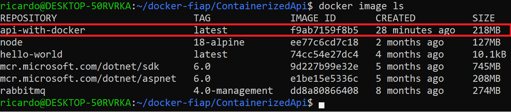
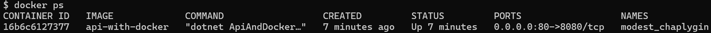
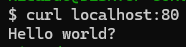
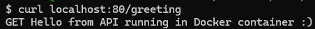
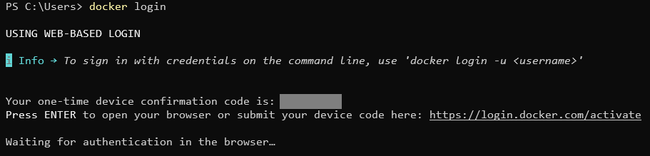
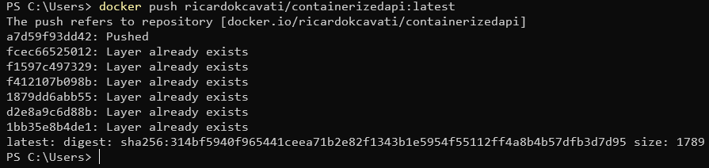
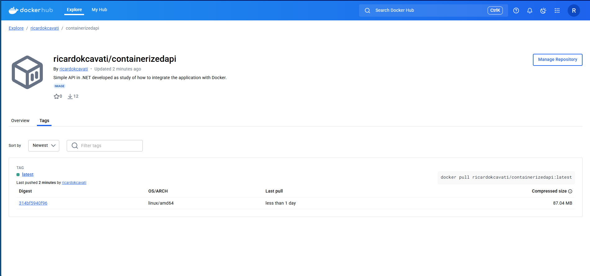

# ContainerizedApi

## How to create images and execute them (2025-14-06)

This project was used as a study case to understand how to run a .NET API in a Docker container.  
A simple API was developed following this [tutorial](https://awswith.net/2021/11/01/running-asp-net-minimal-apis-with-docker/) and a class from my postgraduate course, along with a Dockerfile to create an image and run it.

## How to run it?
When you have all the files of the repository, you need to execute the following commands:

```
docker build -t [image_name]:[tag] .
```

This command with the dot at the end will look for a Dockerfile in the same directory it was executed, if it is executed without errors, a new docker image will be created.  
The '-t' option is very important to identify the image and run it.

Let's suppose the build command is executed like this:

```
docker build -t api-with-docker:latest .
```

After a successful execution, you can validate the creation of your new image with the following command, it will list the available images on your computer, the highlighted one is the one we just created.

```
docker image ls
```



With the image in hands, we can start a container with it, do it the following command needs to be executed:

```
docker run -p [P1]:[P2] -it [image]:[tag]
```

This command will start a container, here is an overview of each argument.

**-p**: Port identification.

**P1**: The port in your local computer which will be used to access the container.

**P2**: The port inside the container that P1 will redirect to, this must be the port you configured your API to be available on, in my case it was 8080.

**-it**: Starts an interactive container, it means you can directly access its shell (when available).

**image**: The name of the image.

**tag**: The version of the image (e.g. latest).

To run the container you can use the following example:

```
docker run -p 80:8080 -it api-with-docker
```

Is this case, it wasn't necessary to include the tag because there is only the 'latest'.

With following command you can validate your container is running.

```
docker ps
```



After that you can execute a http GET on one of the endpoints.

Like this:



And this:



This is it!

## How to push your image to Docker Hub (2025-07-05) 
When you have your image at hand, you can publish it to one of your Docker Hub repositories.

First of all, you need to login to docker, you can do that by using the command.

```
docker login
```

You should see something like this, your default browser will open the specified url, if not, simply open the specified url on your browser, there you should only need to write the code shown on your console.



When the login succeeds, you will see the message "Login Succeeded".

In order to push your image, you need to create a repository on Docker Hub and your image must have the same same name specified in the repo.  

You can check this information on the General page of your repository, my repository is called ```ricardokcavati/containerizedapi```, so I need to rename my image to match this, you can do this with the following command.

```
docker tag [old_name]:[tag] [image_name_on_repository]:[tag]
```

I executed the command the following values.

```
docker tag my_containerized_api:latest ricardokcavati/containerizedapi:latest
```

After that, you can simply push your image to the repository with the following command (I used the example that appears on the top-right corner of the General page of the repository).

```
docker push ricardokcavati/containerizedapi:tagname
```

The command I actually executed only specified the tag as 'latest'.

```
docker push ricardokcavati/containerizedapi:latest
```

The result of the command should be the following.



And you should be able to able to see it on the repository like this.



## My Docker Hub

A few days after the creation of the project, I included a ci pipeline to build the application, log in on Docker Hub and push the image to my repository.

The image for the container can be obtained in this [repository](https://hub.docker.com/r/ricardokcavati/containerizedapi).

And you can pull the image the following command.

```
docker pull ricardokcavati/containerizedapi:latest
```